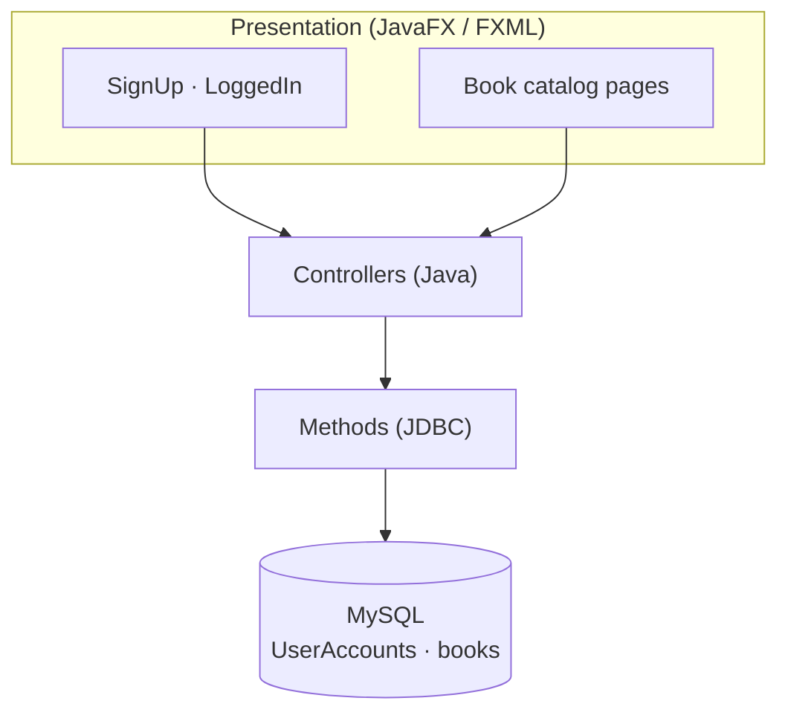

# 📚 Book Reference Tracking System (Kitap Referansları Takip Otomasyonu)

<p>
  
  
  
  
</p>

A desktop **book reference tracking** application built with **JavaFX** (FXML UI) and a
**MySQL** backend. Users can sign up, log in, and manage a catalog of books — each with a
title, author, and cover image.

---

## ✨ Features

- 👤 **User accounts** — sign up and log in
- 📖 **Book catalog** — store books with title (`ad`), author (`yazar`), and cover image (`kapakresmi`)
- 🖥️ **JavaFX UI** — multiple FXML-based pages
- 🗄️ **MySQL persistence** via JDBC

---

## 🏗️ Architecture



---

## 📁 Project Structure

```text
src/main/
├── java/com/example/otomasyon2/
│   ├── main.java        # JavaFX Application entry point
│   ├── SignUp.java      # Sign-up screen controller
│   ├── LoggedIn.java    # Login screen controller
│   ├── page2.java /page3.java   # Catalog pages
│   ├── Kitap.java       # Book model (title, author, cover)
│   └── Methods.java     # DB connection & helpers
└── resources/com/example/otomasyon2/
    ├── SignUp.fxml
    ├── LoggedIn.fxml
    ├── hello-view2.fxml
    └── hello-view3.fxml
```

---

## 🗄️ Database Setup

This app expects a MySQL database with a `UserAccounts` table (username/password) and a
books table. Update your credentials in `Methods.java`
(`databaseName`, `databaseUser`, `databasePassword`) to match your local MySQL setup.

---

## 🚀 Run

This is a **JavaFX** project. Open it in an IDE (e.g. IntelliJ IDEA) configured with the
**JavaFX SDK**, add the MySQL JDBC connector to the classpath, and run `main.java`.

Requires **JDK 17+** and the JavaFX runtime.

---

## 🛠️ Tech Stack

- **Java** + **JavaFX** (FXML UI)
- **MySQL** via JDBC

---

## 📄 License

Released under the [MIT License](LICENSE).
